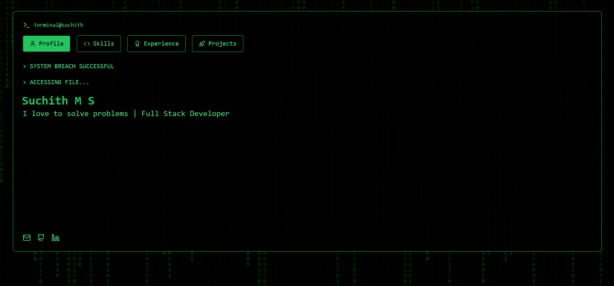

# HackerResume

A retro-themed interactive resume website inspired by classic hacker terminals featuring a Matrix-style rain animation and command-line interface.



## 🚀 Features

- **Command-Line Interface**: Navigate through different sections of the resume using a terminal-inspired interface
- **Matrix Rain Animation**: Classic green-on-black digital rain effect reminiscent of old hacker screens
- **Loading Screen**: Animated loading screen with progress bar mimicking system initialization
- **Responsive Design**: Fully responsive layout that works on all devices
- **Categorized Skills**: Skills organized into logical categories with appropriate icons
- **Project Showcase**: Interactive cards displaying projects with links
- **Smooth Transitions**: Polished transitions between different sections

## 🛠️ Technologies Used

- **React**: Frontend library for building the user interface
- **TailwindCSS**: Utility-first CSS framework for styling
- **Lucide React**: Icon library for the terminal and section icons
- **JavaScript/ES6+**: Modern JavaScript features

## 🔧 Setup and Installation

1. Clone the repository:
   ```bash
   git clone https://github.com/suchithms19/portfolio.git
   cd portfolio
   ```

2. Install dependencies:
   ```bash
   npm install
   ```

3. Start the development server:
   ```bash
   npm run dev
   ```

4. Build for production:
   ```bash
   npm run build
   ```

## 📁 Project Structure

```
frontend/src/
├── App.jsx                  # Main application entry point
├── components/              # All React components
│   ├── effects/             # Visual effects components
│   │   └── MatrixRain.jsx   # Matrix rain animation
│   ├── loading/             # Loading-related components
│   │   └── LoadingScreen.jsx # Loading screen with progress bar
│   └── resume/              # Resume-specific components
│       ├── ExperienceSection.jsx # Experience section
│       ├── HackerResume.jsx # Main resume component
│       ├── ProjectsSection.jsx # Projects section
│       ├── ResumeStyles.jsx # CSS styles for resume
│       ├── SkillsSection.jsx # Skills section
│       └── WelcomeSection.jsx # Welcome/intro section
└── data/                    # Data files
    └── resumeData.js        # Resume data separated from components
```

## 🔄 Customization

To customize this resume with your own information:

1. Edit the `resumeData.js` file in the `src/data` directory to update:
   - Personal information (name, title, contact details)
   - Skills
   - Projects
   - Experience

2. Adjust styling in the component files if needed

## ⚠️ Before Committing to GitHub

Before pushing this code to a public repository, consider:

1. **Personal Information**: Review `resumeData.js` and remove or modify any personal information you don't want to be public
2. **API Keys/Secrets**: Ensure no API keys or secrets are hardcoded in the repository
3. **Email Address**: Consider obfuscating your email address to prevent scraping by bots

---

Made with ❤️ by Suchith 